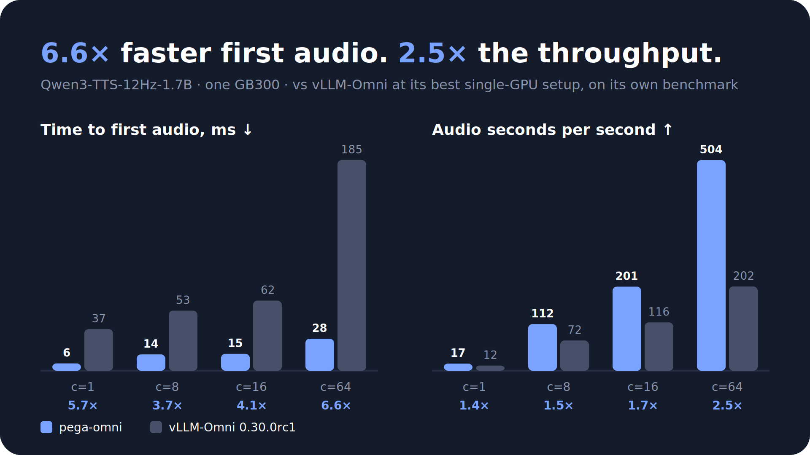

<p align="center">
  
</p>

<h1 align="center">pega-omni</h1>

<p align="center">OpenAI-compatible speech serving in Rust, from the <a href="https://github.com/pegainfer-project/pegainfer">pegainfer</a> project.</p>

<p align="center">
  <a href="docs/qwen3-tts-vs-vllm-omni.md"></a>
</p>

---

Speech models are not text models with an audio suffix. A codec-frame TTS model
streams a packet every few tens of milliseconds for seconds at a time, and the
number a listener feels is **time to first packet** and **whether playback ever
stalls**, not tokens per second. pega-omni is built around those two numbers:
one process, one engine loop, audio handed to the HTTP layer by reference, no
stage-to-stage IPC.

The repository holds the serving front end, the engine contract, a CPU-only
simulated engine used to load-test the front end, and the first GPU engine,
Qwen3-TTS-12Hz-1.7B-CustomVoice ([docs/qwen3-tts.md](docs/qwen3-tts.md)).

## Quick start

```bash
cargo build --release
target/release/pega-omni sim --listen 127.0.0.1:8000

curl -s localhost:8000/v1/audio/speech -H 'content-type: application/json' \
  -d '{"model":"pega-omni-sim","input":"Hello from pega-omni.","voice":"alloy"}' -o hello.wav
```

Qwen3-TTS needs the CUDA toolkit (13.x) to build:

```bash
cargo build --release -p omni-server --features qwen3-tts
target/release/pega-omni qwen3-tts --model-path Qwen3-TTS-12Hz-1.7B-CustomVoice

curl -s localhost:8000/v1/audio/speech -H 'content-type: application/json' \
  -d '{"model":"Qwen3-TTS-12Hz-1.7B-CustomVoice","input":"Hello from pega-omni.","voice":"ryan",
       "extra":{"language":"english"}}' -o hello.wav
```

Any OpenAI client works unchanged:

```python
from openai import OpenAI

client = OpenAI(base_url="http://127.0.0.1:8000/v1", api_key="unused")
with client.audio.speech.with_streaming_response.create(
    model="pega-omni-sim", voice="alloy", input="Streaming speech.", response_format="pcm"
) as resp:
    for chunk in resp.iter_bytes():
        ...
```

## API

| Route | |
|---|---|
| `POST /v1/audio/speech` | OpenAI's request: `model`, `input`, `voice` (name or `{"id": ...}`), `instructions`, `response_format`, `speed`, `stream_format` (`audio` or `sse`) |
| `GET /v1/models` | the served model |
| `GET /v1/audio/voices` | the engine's voices |
| `GET /metrics` | Prometheus: requests by outcome, TTFP, end-to-end latency, audio samples, engine queue |
| `GET /health` | liveness |

Every response streams: audio leaves as the engine emits it. Where the server
differs from OpenAI, it says so instead of guessing:

- `response_format` defaults to `wav`; `wav` and `pcm` (s16le mono) are encoded,
  `mp3` / `opus` / `aac` / `flac` are refused by name.
- A streaming `wav` carries `0xFFFFFFFF` in both size fields.
- Model-specific options go in one `extra` object that the engine declares
  (the simulator accepts `{"frames": N}`, Qwen3-TTS `language` and `seed`);
  unknown top-level fields are a `400`.
- `stream` (not OpenAI's; vLLM clients such as `vllm bench serve` send it) is
  accepted and changes nothing: every response streams.
- A full engine queue is an immediate `429`, never a wait in the front end.

## Layout

| Crate | |
|---|---|
| `omni-engine` | the contract: `Speech`, `Event`, `Handle` / `Inbox`; no trait, a channel |
| `omni-frontend` | axum routes, request parsing, wav / pcm / SSE framing, metrics |
| `omni-sim` | the simulated engine: a pure scheduling core plus a thread shell |
| `omni-cuda` | CUDA kernels (FlashInfer attention, fused transformer, sampling) and the GPU layer |
| `omni-qwen3-tts` | Qwen3-TTS: weights, prompt, talker + code predictor, streaming codec decoder (a kern manifest), engine |
| `omni-server` | the `pega-omni` binary |
| `omni-bench` | open-loop load generator: TTFP, E2E, RTF, playback underrun |

## Measured

The front end against the zero-cost simulator (one engine loop, 32 worker
threads, 1 s of audio per request, unbounded request rate):
**~180k requests/s and ~190k audio-seconds/s with no failures up to 4096
concurrent requests**, TTFP p99 0.3 ms at 64 concurrent. Against a GPU-shaped
paced engine at 2048 concurrent streams it adds no measurable latency over the
engine's own floor and no playback underrun. Method, numbers and the CPU
profile are in [docs/bench.md](docs/bench.md).

## License

Apache-2.0
